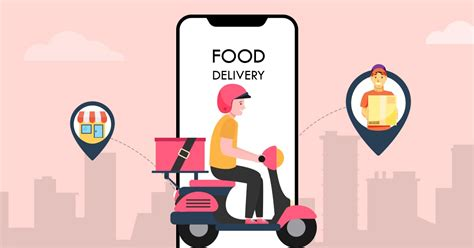

# Delivery Market Analysis

## Mission 

Enhance the data engineering and analytical skills by:
- Working with SQL operations like:
  - SELECT
  - JOIN
  - GROUP BY
  - Aggregations (e.g., average, sum)
  - Advanced queries
- Exploring geospatial data analysis
- Extracting and visualizing insights from food delivery datasets

## Learning Objectives

- To be able to read and understand a SQL database diagram
- Understand and query SQL database structures
- Optimize SQL queries for performance
- Visualize data insights using Python

## The Mission

> We are a small start-up interested in creating a web app that compares prices and different services provided by food delivery apps in Belgium. To that end, we have hired your team to analyze databases provided by a consultant to uncover actionable insights for restaurant partners and consumers.  Our tech stack uses SQL and Python which your solution must use as well. Finally, you must present your intial findings in a week as we will meet with investors in the following week.

The objective is to explore trends, customer preferences, and market dynamics in the food delivery space. Conduct exploratory analysis, summarize findings, and present actionable insights.



## Data

The database provided is structured as SQLite files:

### Deliveroo Database


Use SQL queries to explore relationships between tables and derive insights. 

## Must-have Features (MVP)

The key business questions:

1. What is the price distribution of menu items?
2. What is the distribution of restaurants per location?
3. Which are the top 10 pizza restaurants by rating?
4. Map locations offering kapsalons and their average price.

The open ended questions:

1. How do delivery fees vary across platforms and locations?
2. Which restaurants have the best price-to-rating ratio?
3. How does the availability of vegetarian and vegan dishes vary by area?


## Steps

## 📦 Repo structure
```.
├── DELIVERY-MARKET-ANALYSIS-WITH-SQL
│ └── marketanalysis(env)
├  ── databases
├   │  ──deliveroo.db
├   │  ── takeaway.db
├   │  ── ubereats.db
├  ── market_analysis.ipynb
├  ── analysis.ipynb
├  ── requirements.txt   
├  ── .gitignore
├  ── README.md
 
```
A sample visualization for the question: How does the availability of vegetarian and vegan dishes vary by area?


_Figure : Top 10 Cities with Vegetarian and Vegan Dishes Availability_

## ⏱️ Project Timeline
The initial setup of this project was completed in 5 days.

The project was completed as part of my 7-month AI training bootcamp at BeCode in Ghent, Belgium.
